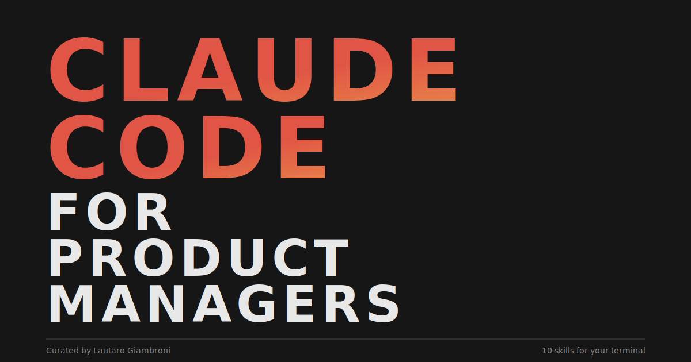

# Claude Code for PMs

**10 skills to turn your terminal into a product management co-pilot.**

<p align="center">
  
</p>

A curated collection of Claude Code skills for Product Managers and Product Leads. Whether you're new to Claude Code or already using it daily, these 10 skills cover the workflows that matter most: planning features, managing execution, researching markets, debugging issues, and creating deliverables.

## What is Claude Code?

[Claude Code](https://docs.anthropic.com/en/docs/claude-code) is Anthropic's CLI tool that brings Claude directly into your terminal. You describe what you need in plain English, and Claude reads your files, runs commands, writes code, and manages tasks, all from the command line.

**Skills** are reusable instructions that teach Claude specialized workflows. Instead of explaining your process every time, a skill encodes it once and Claude follows it consistently.

## Who is This For?

- **Product Managers** who want to move faster on specs, plans, research, and presentations
- **Product Leads** who manage engineering execution and need quality gates
- **Technical PMs** who work in code and want structured workflows
- **Anyone curious about Claude Code** who wants practical, PM-focused examples

## Quick Start

### 1. Install Claude Code

```bash
npm install -g @anthropic-ai/claude-code
```

### 2. Install the Superpowers Plugin (powers skills 1-5)

```bash
claude install @anthropic/claude-code-superpowers
```

### 3. Start Using Skills

Open Claude Code in any project directory:

```bash
cd your-project
claude
```

Then describe what you need. Skills activate automatically based on your request, or you can reference them directly.

## The 10 Skills

### Planning and Strategy

| # | Skill | What It Does | Guide |
|---|-------|-------------|-------|
| 1 | **Brainstorming** | Turns vague ideas into validated designs through structured Q&A before any code is written | [Read more](skills/01-brainstorming.md) |
| 2 | **Writing Plans** | Converts approved designs into detailed, step-by-step implementation tasks with exact file paths and code | [Read more](skills/02-writing-plans.md) |
| 3 | **Verification** | Ensures no one claims work is "done" without running actual tests and showing fresh proof | [Read more](skills/03-verification.md) |

### Execution and Oversight

| # | Skill | What It Does | Guide |
|---|-------|-------------|-------|
| 4 | **Subagent Development** | Executes plans task-by-task with automatic spec compliance and code quality reviews between each step | [Read more](skills/04-subagent-development.md) |
| 5 | **Systematic Debugging** | Enforces a 4-phase scientific debugging process: investigate, analyze, hypothesize, then fix | [Read more](skills/05-systematic-debugging.md) |

### Research and Analysis

| # | Skill | What It Does | Guide |
|---|-------|-------------|-------|
| 6 | **Firecrawl** | Searches the web, scrapes pages, and extracts structured data for competitive analysis and research | [Read more](skills/06-firecrawl.md) |
| 7 | **Project Recap** | Generates a visual HTML summary of any project's current state, recent decisions, and problem areas | [Read more](skills/07-project-recap.md) |

### Communication and Deliverables

| # | Skill | What It Does | Guide |
|---|-------|-------------|-------|
| 8 | **Visual Explainer** | Creates polished HTML diagrams, architecture visuals, flowcharts, and comparison tables | [Read more](skills/08-visual-explainer.md) |
| 9 | **Generate Slides** | Builds magazine-quality HTML slide decks from markdown or plain descriptions | [Read more](skills/09-generate-slides.md) |
| 10 | **PPTX Generator** | Produces .pptx PowerPoint files from markdown for traditional slide-sharing workflows | [Read more](skills/10-pptx.md) |

## How Skills Work

Skills are markdown files that contain instructions for Claude. When Claude Code detects a task that matches a skill's trigger, it loads and follows those instructions automatically.

Some skills come from plugins (like Superpowers), others are standalone files you add to your project or global config.

**There are three places skills can live:**

```
~/.claude/skills/          # Global: available in all projects
your-project/.claude/      # Project: available in one project
plugins/                   # Plugin: installed via `claude install`
```

## The PM Workflow

These skills work best together. Here's how they chain in a typical product cycle:

```
Have a feature idea
       |
       v
  Brainstorming (#1)
  Explore the idea, propose approaches, document design
       |
       v
  Writing Plans (#2)
  Break design into bite-sized implementation tasks
       |
       v
  Subagent Development (#4)
  Execute tasks with automatic quality checks
       |
       v
  Verification (#3)
  Prove everything works with fresh test output
       |
       v
  Ship it
```

For research and communication tasks, use skills 6-10 independently whenever you need them.

## Contributing

Found a skill that's great for PMs? Open a PR. The bar is simple:

1. The skill should solve a real PM problem
2. It should work with Claude Code as-is
3. The guide should include a practical example prompt

## License

MIT

---

Curated by [Lautaro Giambroni](https://github.com/lautarogiambroni)
